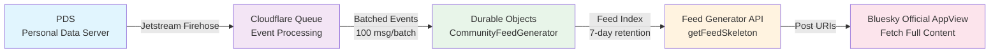

# What is Atrarium?

**Atrarium enables small & open communities (10-200 people) to operate sustainably on AT Protocol using serverless infrastructure and membership-based feed filtering.**

Small community servers face a sustainability crisis. Operating a Fediverse instance (Mastodon, Misskey) costs $30-150/month and requires 5 hours/week of maintenance. This operational burden leads to 50-70% of small instances closing within 1-2 years, affecting tens of thousands of users who lose their online homes.

Atrarium solves this by leveraging AT Protocol's decentralized identity (DID) and Cloudflare's serverless infrastructure. Communities reduce costs by 95% ($0.40-5/month) and time by 80% (1 hour/week) through zero server management and automated scaling. Custom Feed Generators with membership-based filtering enable community-specific feeds viewable directly on the Bluesky official app—no custom client required.

**Positioning**: Atrarium occupies a unique space:
- **vs Fediverse (Mastodon/Misskey)**: Open communities like Fediverse, but without the high operational burden (no VPS management, no database bottlenecks)
- **vs Discord**: Low operational burden like Discord, but with open/public communities instead of closed servers (no platform lock-in, decentralized identity)
- **vs Standard Bluesky**: Built on Bluesky's infrastructure, but adds membership-based feed filtering not available in standard feeds (community-specific logic while remaining compatible with official apps)

## The Problem

### The Sustainability Crisis

Small community servers (10-200 people) in the Japanese-speaking Fediverse face unsustainable operational costs and time burdens:

- **Monthly Costs**: $30-150/month for VPS hosting, domain, and CDN
- **Time Investment**: 5 hours/week for server management, updates, and moderation
- **Closure Rate**: 50-70% of small instances close within 1-2 years
- **Impact Scale**: 450-800 small instances affecting 75,000-200,000 users (Source: Fediverse Observer 2024 data)

### Why This Matters

The closure of small instances doesn't just affect server operators—it impacts entire communities:

1. **Operational Burden**: Server administrators face constant maintenance (security updates, database backups, performance tuning) alongside their day jobs
2. **Isolation Risk**: When an instance closes, users lose their social graph, posts, and identity tied to that server
3. **Technical Complexity**: Self-hosting requires expertise in Linux administration, database management, and network configuration
4. **Legal Liability**: Instance operators bear responsibility for content moderation and GDPR compliance

This creates a tragic dilemma: communities need independence from large platforms, but can't sustain the infrastructure required to maintain it.

## The Solution

Atrarium transforms community operations through serverless architecture and decentralized identity.

### Cost Reduction: 95% Savings

**Before (Fediverse)**: $30-150/month
- VPS: $20-100/month
- Object storage: $5-20/month
- CDN: $5-30/month

**After (Atrarium)**: $0.40-5/month
- Cloudflare Workers Paid: $5/month (includes 10M requests)
- Durable Objects: ~$0.20/month (400k requests free, then $0.15/million)
- Cloudflare Queue: ~$0.20/month (batched event processing)

**Mechanism**: Shared serverless infrastructure eliminates per-community VPS costs. Durable Objects provide per-community isolation without database overhead. Queues handle Firehose ingestion at scale ($0.40/million writes).

### Time Reduction: 80% Savings

**Before (Fediverse)**: 5 hours/week
- Server updates: 2 hours/week
- Database maintenance: 1 hour/week
- Performance monitoring: 2 hours/week

**After (Atrarium)**: 1 hour/week
- Community moderation: 0.5 hours/week
- Content review: 0.5 hours/week

**Mechanism**:
- **Zero Server Management**: Cloudflare handles all infrastructure, scaling, and updates automatically
- **No Database Maintenance**: Durable Objects Storage managed by Cloudflare (no backups, no tuning)
- **Automated Scaling**: Horizontal scaling via Durable Objects (1 object per community, unlimited communities)

### Technical Approach: PDS-First Architecture

Atrarium leverages AT Protocol's **Personal Data Server (PDS)** as the source of truth:

1. **User Data in PDSs**: Community members store posts, profiles, and membership records in their own Personal Data Servers
2. **Custom Feed Generator**: Membership-based filtering creates community-specific feeds from Firehose events
3. **Bluesky AppView Integration**: Feeds are viewable on the official Bluesky app—no custom client required

This architecture enables **zero migration cost** (users bring their DID) and **community independence** (data lives in user PDSs, not a centralized database).

## How It Works

### Data Flow Architecture

### Component Descriptions

1. **PDS (Personal Data Server)**: Each user's data storage (posts, profiles, membership records). Users own their data and can migrate between services using their DID (Decentralized Identifier).

2. **Jetstream Firehose**: AT Protocol's real-time event stream. Atrarium subscribes to post creation events via WebSocket, filtering for community hashtags (e.g., `#atr_a1b2c3d4`).

3. **Cloudflare Queue**: Batched event processing (100 messages/batch). Lightweight filtering (`includes('#atr_')`) happens before Queue, heavyweight filtering (regex `/#atr_[0-9a-f]{8}/`) happens in Queue consumer.

4. **Durable Objects (CommunityFeedGenerator)**: Per-community feed index stored in isolated Durable Object Storage. Each community gets its own instance with 7-day post retention. Membership validation ensures only community members' posts are indexed.

5. **Feed Generator API**: AT Protocol `getFeedSkeleton` endpoint returns post URIs (not full content). Clients fetch actual post data from Bluesky AppView, ensuring compatibility with official apps.

6. **Bluesky Official AppView**: Fetches full post content (text, images, metadata) using URIs from Feed Generator. Users view community feeds in the standard Bluesky app without installing custom clients.

### Integration with Bluesky

Atrarium feeds are **fully compatible with Bluesky's ecosystem**:

- **Discovery**: Users add community feeds via feed URI (`at://did:plc:xxx/app.bsky.feed.generator/community-id`)
- **No Custom Client**: Feeds appear in the official Bluesky app's feed picker
- **Standard Interactions**: Likes, replies, reposts work exactly as in other Bluesky feeds
- **Cross-Platform**: Works on iOS, Android, and web without modification

The key innovation is **membership-based filtering** at the Feed Generator level—something not available in standard Bluesky feeds, which can only filter by hashtags or authors.

## Differentiation

### vs Fediverse (Mastodon/Misskey)

| Aspect | Fediverse | Atrarium |
|--------|-----------|----------|
| **Infrastructure** | VPS (self-managed server) | Serverless (Cloudflare Workers + Durable Objects) |
| **Migration Cost** | High (instance-bound identity) | Zero (DID portable across services) |
| **Scaling** | Vertical (bigger server) → database bottlenecks | Horizontal (more Durable Objects) → unlimited communities |
| **Operational Burden** | 5 hours/week (server maintenance) | 1 hour/week (community moderation only) |
| **Monthly Cost** | $30-150 | $0.40-5 |

**Key Advantage**: Atrarium eliminates the "small instance dilemma"—communities get independence without operational overhead.

### vs Discord

| Aspect | Discord | Atrarium |
|--------|---------|----------|
| **Community Model** | Closed servers (invite-only) | Open communities (public feeds) |
| **Identity** | Platform lock-in (Discord account required) | Decentralized (DID, portable identity) |
| **Data Ownership** | Discord owns all data | Users own data (stored in PDSs) |
| **Federation** | None (centralized platform) | AT Protocol (federated ecosystem) |
| **Cost** | Free (ads + Nitro upsell) | $0.40-5/month (independent, no ads) |

**Key Advantage**: Atrarium provides Discord's ease of use (low ops burden) while preserving Fediverse's values (open communities, data ownership).

### vs Standard Bluesky

| Aspect | Standard Bluesky Feeds | Atrarium |
|--------|------------------------|----------|
| **Filtering** | Hashtags, authors, keywords | Membership-based (verified community members) |
| **Feed Logic** | Simple queries | Custom logic (moderation, role-based access) |
| **Community Features** | None (individual follows) | Membership records, moderation actions, graduated feeds |
| **Cost** | Free (AT Protocol basic feeds) | $0.40-5/month (advanced community features) |
| **AppView Compatibility** | ✅ Native | ✅ Compatible (uses getFeedSkeleton API) |

**Key Advantage**: Atrarium adds community-specific features (membership, moderation, roles) while remaining compatible with official Bluesky apps.

## Current Status & Future Vision

### Phase 1: Complete (PDS-First Architecture)

✅ **Production-Ready Implementation**:

1. **Feed Generator API**: AT Protocol `getFeedSkeleton` endpoint with DID document (`/.well-known/did.json`)
2. **Hashtag System**: System-generated community hashtags (`#atr_[0-9a-f]{8}`) for post association
3. **Moderation**: Hide posts, block users with role-based access (owner/moderator/member)
4. **React Dashboard**: Community management UI with PDS login (authentication via @atproto/api)
5. **Bluesky AppView Compatibility**: Feeds viewable on official Bluesky apps (iOS, Android, web)

**Architecture**: PDS as source of truth → Firehose ingestion → Cloudflare Queue → Durable Objects → Feed Generator API

### Phase 2: Pending (Production Deployment)

🚧 **Next Steps**:

- Deploy Cloudflare Workers + Durable Objects + Queues to production
- Register Feed Generators in Bluesky AppView directory
- Firehose connection monitoring and auto-reconnect
- Dashboard API integration with PDS-first endpoints

### Future Vision: Maintain Optimal Community Size (Phase 2+)

**Concept**: "ちょうどいい大きさを保つ" (Keep communities at the right size)

As communities grow beyond healthy scale (200+ members), Atrarium will support:

- **Automated Splitting**: Suggest sub-community creation when engagement drops due to size
- **Graduated Feeds**: Communities can "graduate" to independent instances while preserving member relationships via DID
- **Dynamic Feed Mixing**: Blend content from related communities to prevent isolation after splits

This ensures communities remain intimate and engaged while avoiding the fragmentation that plagues small Fediverse instances.

**Status**: Conceptual (Phase 2+ roadmap, not current implementation)
