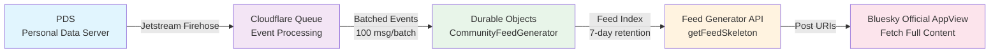

# コンセプト

## 概要

**Atrariumは、サーバーレスインフラストラクチャとメンバーシップベースのフィード フィルタリングを使用して、小規模でオープンなコミュニティ（10〜200人）がBluesky上で持続可能に運営できるようにします。**

小規模コミュニティサーバーは持続可能性の危機に直面しています。Fediverseインスタンス（Mastodon、Misskey）の運営には月額30〜150ドルかかり、週5時間のメンテナンスが必要です。この運用負担により、小規模インスタンスの50〜70%が1〜2年以内に閉鎖され、数万人のユーザーがオンラインの居場所を失っています。

Atrariumは、AT Protocolの分散型アイデンティティ（DID）とCloudflareのサーバーレスインフラストラクチャを活用してこれを解決します。コミュニティは、サーバー管理ゼロと自動スケーリングにより、コストを95%（0.40〜5ドル/月）、時間を80%（1時間/週）削減します。メンバーシップベースのフィルタリングを備えたカスタムフィードジェネレーターにより、Bluesky公式アプリで直接閲覧可能なコミュニティ固有のフィードを実現—カスタムクライアント不要です。

**ポジショニング**: Atrariumは独自の位置を占めています：
- **vs Fediverse (Mastodon/Misskey)**: Fediverseのようなオープンコミュニティですが、高い運用負担がありません（VPS管理不要、データベースボトルネックなし）
- **vs Discord**: Discordのような低い運用負担ですが、クローズドサーバーではなくオープン/パブリックコミュニティです（プラットフォームロックインなし、分散型アイデンティティ）
- **vs 標準Bluesky**: Blueskyのインフラストラクチャ上に構築されていますが、標準フィードでは利用できないメンバーシップベースのフィードフィルタリングを追加します（公式アプリとの互換性を保ちながらコミュニティ固有のロジックを実現）

## 問題

### 持続可能性の危機

日本語圏Fediverseの小規模コミュニティサーバー（10〜200人）は、持続不可能な運用コストと時間的負担に直面しています：

- **月額コスト**: VPSホスティング、ドメイン、CDNで30〜150ドル/月
- **時間投資**: サーバー管理、更新、モデレーションで5時間/週
- **閉鎖率**: 小規模インスタンスの50〜70%が1〜2年以内に閉鎖
- **影響規模**: 450〜800の小規模インスタンスが75,000〜200,000人のユーザーに影響（出典: Fediverse Observer 2024データ）

### なぜこれが重要なのか

小規模インスタンスの閉鎖は、サーバー運営者だけでなく、コミュニティ全体に影響を与えます：

1. **運用負担**: サーバー管理者は、本業と並行して継続的なメンテナンス（セキュリティ更新、データベースバックアップ、パフォーマンスチューニング）に直面します
2. **孤立リスク**: インスタンスが閉鎖されると、ユーザーはそのサーバーに紐付けられたソーシャルグラフ、投稿、アイデンティティを失います
3. **技術的複雑さ**: セルフホスティングには、Linux管理、データベース管理、ネットワーク構成の専門知識が必要です
4. **法的責任**: インスタンス運営者は、コンテンツモデレーションとGDPRコンプライアンスの責任を負います

これにより悲劇的なジレンマが生まれます：コミュニティは大規模プラットフォームからの独立を必要としていますが、それを維持するために必要なインフラストラクチャを維持できません。

## 解決策

Atrariumは、サーバーレスアーキテクチャと分散型アイデンティティを通じて、コミュニティ運営を変革します。

### コスト削減: 95%の節約

**従来（Fediverse）**: 30〜150ドル/月
- VPS: 20〜100ドル/月
- オブジェクトストレージ: 5〜20ドル/月
- CDN: 5〜30ドル/月

**Atrarium導入後**: 0.40〜5ドル/月
- Cloudflare Workers Paid: 5ドル/月（1000万リクエスト含む）
- Durable Objects: 約0.20ドル/月（40万リクエスト無料、その後0.15ドル/100万リクエスト）
- Cloudflare Queue: 約0.20ドル/月（バッチ処理イベント）

**メカニズム**: 共有サーバーレスインフラストラクチャにより、コミュニティごとのVPSコストを排除します。Durable Objectsは、データベースのオーバーヘッドなしにコミュニティごとの分離を提供します。Queuesは、スケールでFirehose取り込みを処理します（0.40ドル/100万書き込み）。

### 時間削減: 80%の節約

**従来（Fediverse）**: 5時間/週
- サーバー更新: 2時間/週
- データベースメンテナンス: 1時間/週
- パフォーマンス監視: 2時間/週

**Atrarium導入後**: 1時間/週
- コミュニティモデレーション: 0.5時間/週
- コンテンツレビュー: 0.5時間/週

**メカニズム**:
- **サーバー管理ゼロ**: Cloudflareがすべてのインフラストラクチャ、スケーリング、更新を自動的に処理します
- **データベースメンテナンス不要**: Durable Objects StorageはCloudflareによって管理されます（バックアップ不要、チューニング不要）
- **自動スケーリング**: Durable Objectsによる水平スケーリング（コミュニティごとに1オブジェクト、無制限のコミュニティ）

### 技術的アプローチ: PDS第一アーキテクチャ

AtrariumはAT Protocolの**Personal Data Server（PDS）**を真実の源として活用します：

1. **PDSのユーザーデータ**: コミュニティメンバーは、投稿、プロフィール、メンバーシップレコードを自分のPersonal Data Serverに保存します
2. **カスタムフィードジェネレーター**: メンバーシップベースのフィルタリングにより、Firehoseイベントからコミュニティ固有のフィードを作成します
3. **Bluesky AppView統合**: フィードはBluesky公式アプリで閲覧可能—カスタムクライアント不要です

このアーキテクチャにより、**移行コストゼロ**（ユーザーはDIDを持参）と**コミュニティの独立性**（データはユーザーのPDSに保存され、集中データベースではない）が実現されます。

## 仕組み

### データフローアーキテクチャ

### コンポーネントの説明

1. **PDS（Personal Data Server）**: 各ユーザーのデータストレージ（投稿、プロフィール、メンバーシップレコード）。ユーザーは自分のデータを所有し、DID（分散型識別子）を使用してサービス間を移行できます。

2. **Jetstream Firehose**: AT Protocolのリアルタイムイベントストリーム。Atrariumは、WebSocket経由で投稿作成イベントをサブスクライブし、コミュニティハッシュタグ（例：`#atr_a1b2c3d4`）でフィルタリングします。

3. **Cloudflare Queue**: バッチ処理イベント（100メッセージ/バッチ）。軽量フィルタリング（`includes('#atr_')`）はQueue前に行われ、重量フィルタリング（正規表現`/#atr_[0-9a-f]{8}/`）はQueueコンシューマーで行われます。

4. **Durable Objects（CommunityFeedGenerator）**: 分離されたDurable Object Storageに保存されたコミュニティごとのフィードインデックス。各コミュニティは、7日間の投稿保持期間を持つ独自のインスタンスを取得します。メンバーシップ検証により、コミュニティメンバーの投稿のみがインデックス化されます。

5. **Feed Generator API**: AT Protocol `getFeedSkeleton`エンドポイントは、投稿URI（完全なコンテンツではない）を返します。クライアントは、Bluesky AppViewから実際の投稿データを取得し、公式アプリとの互換性を確保します。

6. **Bluesky Official AppView**: Feed GeneratorからのURIを使用して、完全な投稿コンテンツ（テキスト、画像、メタデータ）を取得します。ユーザーは、カスタムクライアントをインストールせずに、標準のBlueskyアプリでコミュニティフィードを表示します。

### Blueskyとの統合

Atrariumフィードは**Blueskyエコシステムと完全に互換性があります**：

- **発見**: ユーザーはフィードURI（`at://did:plc:xxx/app.bsky.feed.generator/community-id`）を介してコミュニティフィードを追加します
- **カスタムクライアント不要**: フィードはBluesky公式アプリのフィードピッカーに表示されます
- **標準インタラクション**: いいね、返信、リポストは、他のBlueskyフィードとまったく同じように機能します
- **クロスプラットフォーム**: iOS、Android、Webで変更なしで動作します

主な革新は、Feed Generatorレベルでの**メンバーシップベースのフィルタリング**です—これは、ハッシュタグまたは著者でのみフィルタリングできる標準のBlueskyフィードでは利用できません。

## 差別化

### vs Fediverse（Mastodon/Misskey）

| 側面 | Fediverse | Atrarium |
|--------|-----------|----------|
| **インフラストラクチャ** | VPS（自己管理サーバー） | サーバーレス（Cloudflare Workers + Durable Objects） |
| **移行コスト** | 高い（インスタンス紐付けアイデンティティ） | ゼロ（サービス間でポータブルなDID） |
| **スケーリング** | 垂直（より大きなサーバー）→データベースボトルネック | 水平（より多くのDurable Objects）→無制限のコミュニティ |
| **運用負担** | 5時間/週（サーバーメンテナンス） | 1時間/週（コミュニティモデレーションのみ） |
| **月額コスト** | 30〜150ドル | 0.40〜5ドル |

**主な利点**: Atrariumは「小規模インスタンスのジレンマ」を解消します—コミュニティは運用オーバーヘッドなしに独立性を得ます。

### vs Discord

| 側面 | Discord | Atrarium |
|--------|---------|----------|
| **コミュニティモデル** | クローズドサーバー（招待制） | オープンコミュニティ（パブリックフィード） |
| **アイデンティティ** | プラットフォームロックイン（Discordアカウント必須） | 分散型（DID、ポータブルアイデンティティ） |
| **データ所有権** | Discordがすべてのデータを所有 | ユーザーがデータを所有（PDSに保存） |
| **フェデレーション** | なし（集中型プラットフォーム） | AT Protocol（フェデレーテッドエコシステム） |
| **コスト** | 無料（広告 + Nitroアップセル） | 0.40〜5ドル/月（独立、広告なし） |

**主な利点**: Atrariumは、Discordの使いやすさ（低い運用負担）を提供しながら、Fediverseの価値（オープンコミュニティ、データ所有権）を保持します。

### vs 標準Bluesky

| 側面 | 標準Blueskyフィード | Atrarium |
|--------|------------------------|----------|
| **フィルタリング** | ハッシュタグ、著者、キーワード | メンバーシップベース（検証済みコミュニティメンバー） |
| **フィードロジック** | シンプルなクエリ | カスタムロジック（モデレーション、ロールベースアクセス） |
| **コミュニティ機能** | なし（個別フォロー） | メンバーシップレコード、モデレーションアクション、グラデュエーションフィード |
| **コスト** | 無料（AT Protocol基本フィード） | 0.40〜5ドル/月（高度なコミュニティ機能） |
| **AppView互換性** | ✅ ネイティブ | ✅ 互換性あり（getFeedSkeleton API使用） |

**主な利点**: Atrariumは、公式Blueskyアプリとの互換性を保ちながら、コミュニティ固有の機能（メンバーシップ、モデレーション、ロール）を追加します。

## 現在のステータスと将来のビジョン

### Phase 1: 完了（PDS第一アーキテクチャ）

✅ **本番環境対応実装**：

1. **Feed Generator API**: AT Protocol `getFeedSkeleton`エンドポイントとDIDドキュメント（`/.well-known/did.json`）
2. **ハッシュタグシステム**: 投稿関連付け用のシステム生成コミュニティハッシュタグ（`#atr_[0-9a-f]{8}`）
3. **モデレーション**: ロールベースアクセス（owner/moderator/member）による投稿非表示、ユーザーブロック
4. **Reactダッシュボード**: PDSログインを備えたコミュニティ管理UI（@atproto/apiによる認証）
5. **Bluesky AppView互換性**: 公式Blueskyアプリ（iOS、Android、Web）で閲覧可能なフィード

**アーキテクチャ**: PDSを真実の源として → Firehose取り込み → Cloudflare Queue → Durable Objects → Feed Generator API

### Phase 2: 保留中（本番デプロイメント）

🚧 **次のステップ**：

- Cloudflare Workers + Durable Objects + Queuesを本番環境にデプロイ
- Bluesky AppViewディレクトリにFeed Generatorを登録
- Firehose接続監視と自動再接続
- PDS第一エンドポイントとのダッシュボードAPI統合

### 将来のビジョン: 最適なコミュニティサイズの維持（Phase 2+）

**コンセプト**: 「ちょうどいい大きさを保つ」（コミュニティを適切なサイズに保つ）

コミュニティが健全な規模（200人以上）を超えて成長すると、Atrariumは以下をサポートします：

- **自動分割**: サイズによってエンゲージメントが低下した場合、サブコミュニティの作成を提案
- **グラデュエーションフィード**: コミュニティは、DIDを介してメンバー関係を保持しながら、独立したインスタンスに「グラデュエーション」できます
- **動的フィード混合**: 分割後の孤立を防ぐために、関連コミュニティからのコンテンツをブレンド

これにより、小規模Fediverseインスタンスを悩ませる断片化を回避しながら、コミュニティが親密で活発な状態を維持できます。

**ステータス**: コンセプト（Phase 2+ロードマップ、現在の実装ではない）
