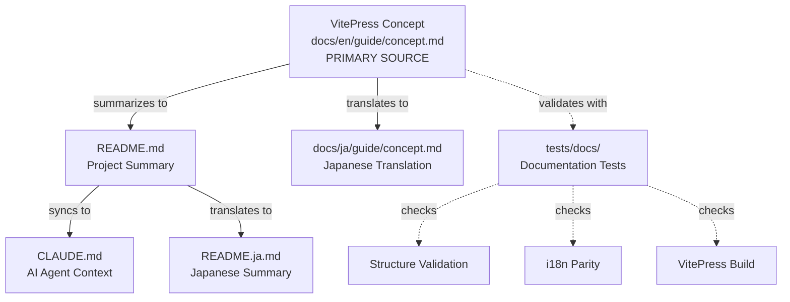
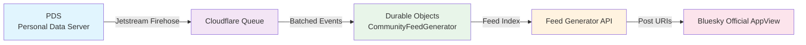
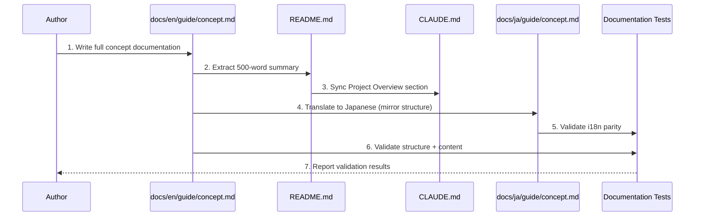
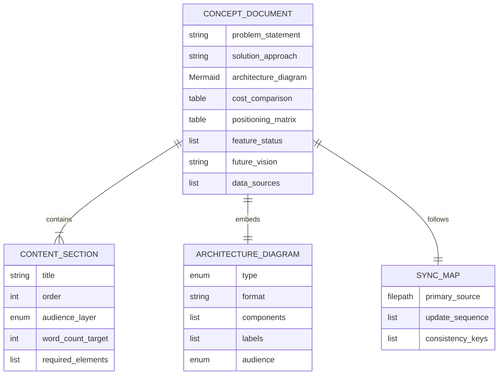

# Data Model: Concept Documentation

**Feature**: 008- Concept Redefinition
**Date**: 2025-10-05
**Type**: Documentation Structure

## Overview

This data model defines the structure of concept documentation entities and their relationships. Since this is a documentation-only feature, "entities" represent documentation artifacts rather than database records.

---

## Entity: Concept Document

**Purpose**: Primary documentation artifact explaining Atrarium's problem-solution relationship

### Attributes

| Attribute | Type | Description | Validation Rules |
|-----------|------|-------------|------------------|
| `problem_statement` | string | Core problem definition (small & open community sustainability crisis) | MUST include costs ($30-150/month), time (5 hrs/week), closure rate (50-70%) |
| `solution_approach` | string | High-level solution description (serverless + membership filtering) | MUST mention PDS-first architecture + Custom Feed Generator |
| `architecture_diagram` | Mermaid | Visual data flow representation | MUST show 5-stage pipeline: PDS → Firehose → Queue → DO → Feed → AppView |
| `cost_comparison` | table | Monthly expense breakdown | MUST show old ($30-150) vs new ($0.40-5) with calculation formula |
| `positioning_matrix` | table/diagram | Differentiation from alternatives | MUST compare 3 dimensions (openness, ops burden, features) vs 3 alternatives (Fediverse, Discord, Bluesky) |
| `feature_status` | list | Completed capabilities (Phase 1) | MUST reference: Feed Generator API, hashtag system, moderation, React dashboard, Bluesky AppView compatibility |
| `future_vision` | string | Phase 2+ roadmap | SHOULD mention "Maintain optimal community size" (automated splitting/graduation) |
| `data_sources` | list | Citations for claims | MUST include: "Fediverse Observer 2024 data" for user/instance numbers |

### Relationships



### Lifecycle States

| State | Description | Transition Trigger |
|-------|-------------|-------------------|
| `draft` | Initial content creation | VitePress concept.md written |
| `synchronized` | README/CLAUDE updated | Summary extraction complete |
| `translated` | Japanese version created | i18n translation complete |
| `validated` | All tests passing | Documentation tests pass + VitePress build succeeds |
| `published` | Deployed to production | Merged to master branch → Cloudflare Pages auto-deploy |

### Validation Rules

1. **Structure Validation**:
   - MUST contain 6 sections: Overview, The Problem, The Solution, How It Works, Differentiation, Current Status & Future Vision
   - MUST use two-layer model: non-technical content before technical details

2. **Content Validation**:
   - MUST cite "Fediverse Observer 2024" for 450-800 instances / 75,000-200,000 users claim
   - MUST include Mermaid data flow diagram (PDS → Firehose → Queue → DO → Feed → AppView)
   - MUST differentiate from 3 alternatives (Fediverse, Discord, Standard Bluesky)
   - MUST align with implementation status (PDS-first Phase 1 complete)

3. **i18n Validation**:
   - `docs/ja/guide/concept.md` MUST mirror `docs/en/guide/concept.md` structure
   - Section count MUST match between EN and JA versions

4. **Synchronization Validation**:
   - README.md summary MUST link to VitePress concept docs
   - CLAUDE.md "Project Overview" MUST reflect VitePress content
   - Cost data MUST be consistent across all files ($0.40-5/month)

---

## Entity: Architecture Diagram

**Purpose**: Visual representation of technical architecture for developer comprehension

### Attributes

| Attribute | Type | Description | Validation Rules |
|-----------|------|-------------|------------------|
| `type` | enum | Diagram category | MUST be one of: `data-flow`, `positioning-matrix` |
| `format` | string | Rendering format | MUST be "Mermaid.js" (VitePress native support) |
| `components` | list | Included elements | Data flow MUST include: [PDS, Firehose, Queue, Durable Objects, Feed API, AppView] |
| `labels` | list | Component descriptions | MUST label each component with technical term (e.g., "PDS: Personal Data Server") |
| `audience` | enum | Target reader | `technical` (data flow) or `non-technical` (positioning matrix) |

### Diagram Types

#### 1. Data Flow Diagram (Technical)


**Validation Rules**:
- MUST show 5-stage pipeline
- MUST include component labels (PDS, Firehose, Queue, DO, Feed, AppView)
- MUST use left-to-right flow direction (readable by Western + Japanese audiences)

#### 2. Positioning Matrix (Non-Technical)
```mermaid
quadrantChart
    title Community Platform Positioning
    x-axis Closed Communities --> Open Communities
    y-axis High Ops Burden --> Low Ops Burden
    quadrant-1 Not Ideal (Open but Hard to Run)
    quadrant-2 Atrarium's Sweet Spot
    quadrant-3 Platform Lock-in Risk
    quadrant-4 Current Landscape
    Discord: [0.2, 0.8]
    Fediverse (Mastodon): [0.8, 0.2]
    Standard Bluesky: [0.6, 0.9]
    Atrarium: [0.8, 0.9]
```

**Validation Rules**:
- MUST compare 4 platforms (Atrarium + 3 alternatives)
- MUST use 2 dimensions (openness, ops burden)
- MUST position Atrarium in "sweet spot" quadrant (high openness + low ops burden)

### Relationships

- **Used By**: Concept Document (embedded in "How It Works" section)
- **Validates**: FR-013 (developer feasibility evaluation requirement)
- **Renders In**: VitePress docs, GitHub README preview

---

## Entity: Documentation Synchronization Map

**Purpose**: Defines update propagation flow and consistency rules

### Attributes

| Attribute | Type | Description | Validation Rules |
|-----------|------|-------------|------------------|
| `primary_source` | file path | Canonical documentation | MUST be `docs/en/guide/concept.md` (VitePress) |
| `update_sequence` | ordered list | Synchronization order | MUST follow: VitePress → README → CLAUDE → i18n |
| `consistency_keys` | list | Values that must match across files | Cost ($0.40-5/month), Phase status (Phase 1 complete), Architecture (PDS-first) |

### Update Flow



### Consistency Rules

1. **Cost Data Consistency**:
   - VitePress: Detailed breakdown (Workers $5 + DO + Queue = $0.40-5)
   - README: Summary ($0.40-5/month)
   - CLAUDE: Reference to cost efficiency
   - All MUST cite same range ($0.40-5/month)

2. **Architecture Terminology Consistency**:
   - MUST use "PDS-first architecture" (not "decentralized storage" or other variants)
   - MUST use "Custom Feed Generator" (not "feed service" or "feed builder")
   - MUST use "membership-based filtering" (not "access control" or "permission system")

3. **Phase Status Consistency**:
   - MUST state "Phase 1 (PDS-first architecture) complete"
   - MUST state "Production deployment pending (Phase 2)"
   - Future vision SHOULD use "Phase 2+" prefix

---

## Entity: Content Section

**Purpose**: Structural component of Concept Document

### Attributes

| Attribute | Type | Description | Validation Rules |
|-----------|------|-------------|------------------|
| `title` | string | Section heading | MUST be one of 6 required sections |
| `order` | integer | Position in document | 1=Overview, 2=Problem, 3=Solution, 4=How It Works, 5=Differentiation, 6=Status & Vision |
| `audience_layer` | enum | Target reader level | `non-technical` (Overview, Problem, Solution) or `technical` (How It Works, Differentiation, Status) |
| `word_count_target` | integer | Recommended length | 200-400 words per section |
| `required_elements` | list | Must-have content | See section-specific requirements below |

### Section Requirements

#### 1. Overview
- **Audience**: Non-technical
- **Required Elements**:
  - One-sentence project description
  - Problem statement (concise)
  - Solution approach (concise)
  - Positioning statement (vs Fediverse/Discord/Bluesky)
- **Success Criteria**: Reader understands "what" and "why" in < 30 seconds

#### 2. The Problem
- **Audience**: Non-technical
- **Required Elements**:
  - Sustainability crisis data (costs, time, closure rate)
  - User pain points (4 categories: ops burden, isolation, complexity, legal)
  - Fediverse Observer 2024 data citation
- **Success Criteria**: Reader empathizes with problem (community managers relate to pain points)

#### 3. The Solution
- **Audience**: Non-technical → Technical transition
- **Required Elements**:
  - Cost reduction mechanism (95% savings explanation)
  - Time reduction mechanism (80% savings explanation)
  - High-level technical approach (PDS-first + Custom Feed)
- **Success Criteria**: Reader understands "how" solution works conceptually

#### 4. How It Works
- **Audience**: Technical
- **Required Elements**:
  - Mermaid data flow diagram (PDS → AppView)
  - Component descriptions (PDS, Firehose, Queue, DO, Feed, AppView)
  - Bluesky AppView integration explanation
- **Success Criteria**: Developer can evaluate architecture feasibility (FR-013)

#### 5. Differentiation
- **Audience**: Technical + Non-technical
- **Required Elements**:
  - vs Fediverse (serverless, no VPS, DID migration, horizontal scaling)
  - vs Discord (open communities, no platform lock-in)
  - vs Standard Bluesky (membership-based filtering)
- **Success Criteria**: Reader understands unique value proposition

#### 6. Current Status & Future Vision
- **Audience**: Technical + Non-technical
- **Required Elements**:
  - Phase 1 completion statement (PDS-first architecture)
  - Completed capabilities list (Feed API, hashtags, moderation, dashboard, AppView compatibility)
  - Phase 2+ vision ("Maintain optimal community size")
- **Success Criteria**: Reader knows what works now + what's planned

---

## Relationships Summary



---

## Validation Checklist

### Structure Validation
- [ ] Concept Document contains 6 required sections
- [ ] Sections follow correct order (Overview → Problem → Solution → How It Works → Differentiation → Status)
- [ ] Two-layer model applied (non-technical → technical)

### Content Validation
- [ ] Fediverse Observer 2024 data cited
- [ ] Data flow diagram shows 5-stage pipeline
- [ ] 3 alternatives differentiated (Fediverse, Discord, Bluesky)
- [ ] Cost data consistent ($0.40-5/month) across all files
- [ ] Phase status accurate (Phase 1 complete, Phase 2 pending)

### Synchronization Validation
- [ ] VitePress concept.md is primary source
- [ ] README.md summary extracted (< 500 words)
- [ ] CLAUDE.md synchronized
- [ ] i18n parity maintained (EN ↔ JA structure match)

### Diagram Validation
- [ ] Data flow diagram (Mermaid) renders correctly
- [ ] Positioning matrix (Mermaid quadrant chart) shows 4 platforms
- [ ] All diagram components labeled

---

## Next Steps

1. ✅ Data model defined
2. → Create contracts/concept-doc-structure.md (YAML schema)
3. → Create quickstart.md (validation steps)
4. → Generate tasks.md (/tasks command)
