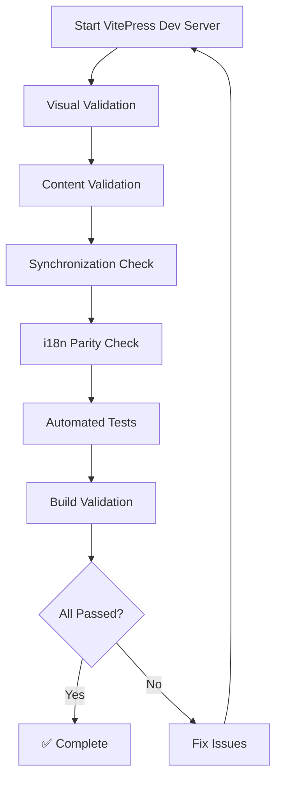

# Quickstart: Concept Documentation Validation

**Feature**: 008- Concept Redefinition
**Purpose**: Validate that concept documentation meets all functional requirements
**Estimated Time**: 15-20 minutes

---

## Prerequisites

Before starting validation, ensure:

```bash
# 1. Install VitePress dependencies (if not already installed)
cd /workspaces/atrarium/docs
npm install

# 2. Verify documentation tests are configured
cd /workspaces/atrarium
npm run test:docs --version  # Should show Vitest version

# 3. Check current branch
git branch --show-current  # Should show: 008-
```

**Required Tools**:
- Node.js 18+ (for VitePress)
- Web browser (for visual validation)
- Text editor (for content review)

---

## Validation Flow



---

## Step 1: Visual Validation (VitePress Dev Server)

**Objective**: Verify concept documentation renders correctly and is readable

### 1.1 Start Development Server

```bash
cd /workspaces/atrarium/docs
npm run docs:dev
```

**Expected Output**:
```
  vitepress v1.x.x

  ➜  Local:   http://localhost:5173/
  ➜  Network: use --host to expose
  ➜  press h to show help
```

### 1.2 Navigate to Concept Documentation

1. Open browser: http://localhost:5173/
2. Click: **Guide** → **Concept** (or navigate to http://localhost:5173/en/guide/concept.html)

### 1.3 Visual Checklist

**Section: Overview**
- [ ] ✅ One-sentence description clearly states what Atrarium is
- [ ] ✅ Problem statement mentions "small & open communities"
- [ ] ✅ Solution approach mentions "serverless + membership filtering"
- [ ] ✅ Positioning mentions Fediverse, Discord, and Bluesky
- [ ] ✅ Readable by non-technical person (subjective judgment)

**Section: The Problem**
- [ ] ✅ Costs stated: $30-150/month
- [ ] ✅ Time stated: 5 hours/week
- [ ] ✅ Closure rate stated: 50-70%
- [ ] ✅ Citation present: "Fediverse Observer 2024"
- [ ] ✅ User pain points (4 categories): ops burden, isolation, complexity, legal

**Section: The Solution**
- [ ] ✅ Cost comparison table visible (old vs new)
- [ ] ✅ 95% cost savings explained (not just stated)
- [ ] ✅ 80% time savings explained (not just stated)
- [ ] ✅ Technical terms introduced gently (PDS defined, Custom Feed explained)

**Section: How It Works**
- [ ] ✅ Mermaid diagram renders (data flow visualization)
- [ ] ✅ Diagram shows 5 stages: PDS → Firehose → Queue → DO → Feed → AppView
- [ ] ✅ Component descriptions present (explain each stage)
- [ ] ✅ Bluesky AppView integration explained

**Section: Differentiation**
- [ ] ✅ vs Fediverse comparison (3+ points)
- [ ] ✅ vs Discord comparison (3+ points)
- [ ] ✅ vs Standard Bluesky comparison (3+ points)
- [ ] ✅ Positioning visualization (table or diagram)

**Section: Current Status & Future Vision**
- [ ] ✅ "Phase 1 complete" statement present
- [ ] ✅ 5 completed capabilities listed
- [ ] ✅ Future vision marked as "Phase 2+" (not current)

**⏱️ Comprehension Test (FR-012)**:
- [ ] ✅ Can understand concept in < 2 minutes (subjective judgment)
- [ ] ✅ If unclear, note specific sections for revision

---

## Step 2: Content Validation (Data Accuracy)

**Objective**: Verify all claims are accurate and citations present

### 2.1 Data Citation Check

```bash
# Search for Fediverse Observer citation
cd /workspaces/atrarium
grep -i "fediverse observer 2024" docs/en/guide/concept.md
```

**Expected**: At least 1 match in "The Problem" section

### 2.2 Cost Data Consistency

Check cost data appears correctly:
```bash
# VitePress
grep -E '\$0\.40-5/month|\$0\.40-\$5/month' docs/en/guide/concept.md

# README
grep -E '\$0\.40-5/month|\$0\.40-\$5/month' README.md

# CLAUDE.md (if updated)
grep -E '\$0\.40-5/month|\$0\.40-\$5/month' CLAUDE.md
```

**Expected**: Consistent cost range ($0.40-5/month) across all files

### 2.3 Architecture Component Check

```bash
# Verify data flow components mentioned
grep -E 'PDS|Firehose|Queue|Durable Objects|Feed.*API|AppView' docs/en/guide/concept.md
```

**Expected**: All 6 components present in "How It Works" section

### 2.4 Phase Status Check

```bash
# Verify Phase 1 complete, Phase 2 pending
grep -i "phase 1.*complete" docs/en/guide/concept.md
grep -i "phase 2.*pending\|phase 2+" docs/en/guide/concept.md
```

**Expected**:
- Phase 1 marked as complete
- Phase 2 marked as pending/future

---

## Step 3: Synchronization Check

**Objective**: Verify README.md and CLAUDE.md are synchronized with VitePress content

### 3.1 README.md Summary Check

```bash
# Open README.md
cat README.md | head -50
```

**Manual Checklist**:
- [ ] ✅ Project Overview section present (top of file)
- [ ] ✅ Links to VitePress concept docs (https://docs.atrarium.net/en/guide/concept.html or relative path)
- [ ] ✅ Summary is < 500 words
- [ ] ✅ Positioning mentions Fediverse/Discord/Bluesky
- [ ] ✅ Cost data matches VitePress ($0.40-5/month)

### 3.2 CLAUDE.md Synchronization Check

```bash
# Check if CLAUDE.md was updated
git diff CLAUDE.md | head -30
```

**Manual Checklist**:
- [ ] ✅ Project Overview section reflects VitePress content
- [ ] ✅ Positioning summary added (vs Fediverse/Discord/Bluesky)
- [ ] ✅ Future vision mentioned (Phase 2+ "optimal community size")
- [ ] ✅ Architecture section links to VitePress diagram (not duplicated)

---

## Step 4: i18n Parity Check

**Objective**: Verify Japanese translation mirrors English structure

### 4.1 Visual Check (Japanese Version)

1. In browser, navigate to: http://localhost:5173/ja/guide/concept.html
2. Verify Japanese version exists and renders

### 4.2 Section Count Check

```bash
# Count sections in EN and JA
EN_SECTIONS=$(grep -c "^## " docs/en/guide/concept.md)
JA_SECTIONS=$(grep -c "^## " docs/ja/guide/concept.md)

echo "EN sections: $EN_SECTIONS"
echo "JA sections: $JA_SECTIONS"
```

**Expected**: Same number of sections (6)

### 4.3 Diagram Parity Check

```bash
# Count Mermaid diagrams in EN and JA
EN_DIAGRAMS=$(grep -c "\`\`\`mermaid" docs/en/guide/concept.md)
JA_DIAGRAMS=$(grep -c "\`\`\`mermaid" docs/ja/guide/concept.md)

echo "EN diagrams: $EN_DIAGRAMS"
echo "JA diagrams: $JA_DIAGRAMS"
```

**Expected**: Same number of diagrams

---

## Step 5: Automated Tests

**Objective**: Run documentation test suite to validate structure and content

### 5.1 Run Documentation Tests

```bash
cd /workspaces/atrarium
npm run test:docs
```

**Expected Output**:
```
✓ docs/navigation.test.ts (X tests)
✓ docs/i18n.test.ts (X tests)
✓ docs/links.test.ts (X tests)
✓ docs/build.test.ts (X tests)
✓ docs/concept-structure.test.ts (X tests) [if created]

 Test Files  X passed (X)
      Tests  X passed (X)
```

### 5.2 Run Specific Concept Tests (if created)

```bash
# If concept-structure.test.ts was created
npm run test:docs -- concept-structure.test.ts
```

**Expected Validations**:
- [ ] ✅ 6 required sections present
- [ ] ✅ Fediverse Observer citation found
- [ ] ✅ Data flow diagram present
- [ ] ✅ 3 alternatives differentiated (Fediverse, Discord, Bluesky)

### 5.3 i18n Parity Test

```bash
npm run test:docs -- i18n.test.ts
```

**Expected**: No missing translations, EN ↔ JA section count matches

---

## Step 6: Build Validation

**Objective**: Verify VitePress build succeeds and concept.md is included

### 6.1 Build Documentation Site

```bash
cd /workspaces/atrarium/docs
npm run docs:build
```

**Expected Output**:
```
vitepress v1.x.x building client + server bundles...
✓ building client + server bundles...
✓ rendering pages...
build complete in X.XXs.
```

**Performance Check**:
- [ ] ✅ Build completes in < 60s

### 6.2 Verify Build Output

```bash
# Check if concept.md was built
ls -la .vitepress/dist/en/guide/ | grep concept
ls -la .vitepress/dist/ja/guide/ | grep concept
```

**Expected**:
- `.vitepress/dist/en/guide/concept.html` exists
- `.vitepress/dist/ja/guide/concept.html` exists

### 6.3 Preview Production Build

```bash
npm run docs:preview
```

**Manual Check**:
1. Open http://localhost:4173/
2. Navigate to concept page
3. Verify diagrams render correctly
4. Verify no broken links

---

## Step 7: Final Checklist

### Content Quality
- [ ] ✅ All 6 sections present and complete
- [ ] ✅ Fediverse Observer 2024 citation included
- [ ] ✅ Data flow diagram shows 5-stage pipeline
- [ ] ✅ 3 alternatives differentiated (Fediverse, Discord, Bluesky)
- [ ] ✅ Comprehensible in < 2 minutes (FR-012)

### Technical Accuracy
- [ ] ✅ Cost data accurate ($0.40-5/month)
- [ ] ✅ Architecture components correct (PDS → AppView)
- [ ] ✅ Phase status accurate (Phase 1 complete, Phase 2 pending)
- [ ] ✅ Completed capabilities list accurate (5 items)

### Synchronization
- [ ] ✅ README.md summary extracted (< 500 words)
- [ ] ✅ README.md links to VitePress docs
- [ ] ✅ CLAUDE.md synchronized (positioning + future vision added)
- [ ] ✅ i18n parity maintained (EN ↔ JA section count matches)

### Build & Tests
- [ ] ✅ VitePress build succeeds (< 60s)
- [ ] ✅ Documentation tests pass (`npm run test:docs`)
- [ ] ✅ No broken links in built site
- [ ] ✅ Mermaid diagrams render in production build

---

## Success Criteria

**All checkboxes above must be checked (✅) to consider validation complete.**

If any validation fails:
1. Note the specific failure in issue tracker or task list
2. Fix the issue
3. Re-run validation from Step 1

---

## Troubleshooting

### VitePress Dev Server Won't Start

```bash
# Clear VitePress cache
rm -rf docs/.vitepress/cache
rm -rf docs/.vitepress/dist

# Reinstall dependencies
cd docs
rm -rf node_modules package-lock.json
npm install

# Try again
npm run docs:dev
```

### Mermaid Diagrams Don't Render

1. Check Mermaid syntax: https://mermaid.js.org/
2. Verify triple backticks: ` ```mermaid ` (not ` ```mermai ` or ` ```Mermaid `)
3. Check VitePress Mermaid plugin: `docs/.vitepress/config.ts`

### i18n Parity Test Fails

```bash
# Compare section counts manually
grep "^## " docs/en/guide/concept.md | wc -l
grep "^## " docs/ja/guide/concept.md | wc -l

# If counts differ, check for missing sections in JA version
diff <(grep "^## " docs/en/guide/concept.md) <(grep "^## " docs/ja/guide/concept.md)
```

### Build Fails with Error

```bash
# Check for syntax errors in Markdown
npx markdownlint docs/en/guide/concept.md
npx markdownlint docs/ja/guide/concept.md

# Check for broken links
npm run test:docs -- links.test.ts
```

---

## Next Steps

After successful validation:

1. ✅ Mark validation complete in task list
2. ✅ Commit changes: `git add . && git commit -m "docs: update concept documentation (008-)"`
3. ✅ Run final test suite: `npm test`
4. ✅ Push to remote: `git push origin 008-`
5. ✅ Create pull request (if applicable)

**Validation Complete!** 🎉

Concept documentation now clearly explains:
- What Atrarium is (problem + solution)
- How it works (PDS-first architecture)
- Why it's different (vs Fediverse/Discord/Bluesky)
- Current status & future vision
