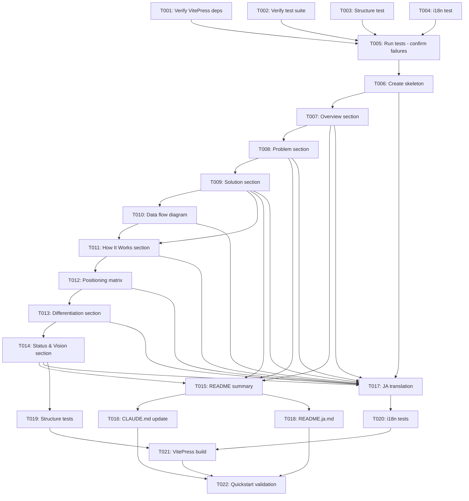

# Tasks: Concept Redefinition

**Input**: Design documents from `/workspaces/atrarium/specs/008-/`
**Prerequisites**: plan.md ✅, research.md ✅, data-model.md ✅, contracts/ ✅, quickstart.md ✅

## Execution Flow (main)
```
1. Load plan.md from feature directory
   → ✅ Loaded successfully
   → Tech stack: Markdown (VitePress 1.x), Mermaid diagrams
   → Libraries: VitePress, i18next (EN/JA)
   → Structure: Documentation-only update (docs/, README.md, CLAUDE.md)
2. Load optional design documents:
   → data-model.md ✅: 4 entities (Concept Document, Architecture Diagram, Sync Map, Content Section)
   → contracts/ ✅: concept-doc-structure.md (6 section contracts + validation tests)
   → research.md ✅: 4 decisions (VitePress-first, Mermaid, 3-way differentiation, subjective validation)
   → quickstart.md ✅: 7-step validation flow
3. Generate tasks by category:
   → Setup: VitePress verification, test setup (2 tasks)
   → Tests: Documentation structure tests, i18n tests (2 tasks)
   → Core: VitePress content creation, diagrams, sections (9 tasks)
   → Integration: Synchronization (README, CLAUDE, i18n) (4 tasks)
   → Polish: Validation, build, review (5 tasks)
4. Apply task rules:
   → Different files = mark [P] for parallel
   → Same file = sequential (concept.md sections)
   → Tests before implementation (TDD for docs)
5. Number tasks sequentially (T001-T022)
6. Dependencies: Tests → Content → Sync → Validation
7. Parallel execution: [P] tasks = independent files
8. Validation: All contracts covered ✅, All entities addressed ✅
9. Return: SUCCESS (22 tasks ready for execution)
```

## Format: `[ID] [P?] Description`
- **[P]**: Can run in parallel (different files, no dependencies)
- All paths are absolute from repository root

## Path Conventions
- **VitePress docs**: `/workspaces/atrarium/docs/en/guide/concept.md` (primary)
- **Japanese docs**: `/workspaces/atrarium/docs/ja/guide/concept.md` (translation)
- **README**: `/workspaces/atrarium/README.md` (summary)
- **CLAUDE**: `/workspaces/atrarium/CLAUDE.md` (AI context)
- **Tests**: `/workspaces/atrarium/tests/docs/` (documentation tests)

---

## Phase 3.1: Setup & Verification

- [x] **T001** [P] Verify VitePress dependencies installed
  - **File**: `/workspaces/atrarium/docs/package.json`
  - **Action**: Run `cd /workspaces/atrarium/docs && npm install` to ensure VitePress and Mermaid support
  - **Validation**: Check `node_modules/vitepress` and `node_modules/mermaid` exist
  - **Parallel**: Independent of other setup tasks

- [x] **T002** [P] Verify documentation test suite configured
  - **File**: `/workspaces/atrarium/tests/docs/` directory
  - **Action**: Confirm `navigation.test.ts`, `i18n.test.ts`, `links.test.ts`, `build.test.ts` exist
  - **Validation**: Run `npm run test:docs --version` to verify Vitest configured
  - **Parallel**: Independent of T001

---

## Phase 3.2: Tests First (TDD for Documentation) ⚠️ MUST COMPLETE BEFORE 3.3

**CRITICAL: These tests MUST be written and MUST FAIL before ANY documentation content is created**

- [x] **T003** [P] Create concept structure validation test
  - **File**: `/workspaces/atrarium/tests/docs/concept-structure.test.ts`
  - **Action**: Write test to validate 6 required sections (Overview, The Problem, The Solution, How It Works, Differentiation, Current Status & Future Vision)
  - **Assertions**:
    - `expect(content).toContain('## Overview')`
    - `expect(content).toContain('## The Problem')`
    - `expect(content).toContain('## The Solution')`
    - `expect(content).toContain('## How It Works')`
    - `expect(content).toContain('## Differentiation')`
    - `expect(content).toContain('## Current Status & Future Vision')`
    - `expect(content).toMatch(/Fediverse Observer 2024/)`
    - `expect(content).toContain('```mermaid')`
    - `expect(content).toMatch(/vs.*Fediverse/i)`
    - `expect(content).toMatch(/vs.*Discord/i)`
    - `expect(content).toMatch(/vs.*Bluesky/i)`
  - **Expected**: Test FAILS (file not created yet)
  - **Parallel**: Independent file, no dependencies

- [x] **T004** [P] Create i18n parity validation test for concept docs
  - **File**: `/workspaces/atrarium/tests/docs/i18n-concept.test.ts`
  - **Action**: Write test to validate EN ↔ JA structure parity
  - **Assertions**:
    - `expect(enSections.length).toBe(6)`
    - `expect(jaSections.length).toBe(enSections.length)`
    - `expect(enDiagrams.length).toBe(jaDiagrams.length)`
  - **Expected**: Test FAILS (Japanese file not created yet)
  - **Parallel**: Independent file, no dependencies

- [x] **T005** Run documentation tests to confirm failures
  - **Command**: `cd /workspaces/atrarium && npm run test:docs`
  - **Action**: Execute test suite to verify T003-T004 tests FAIL as expected
  - **Validation**: Tests should fail with "concept.md not found" or similar errors
  - **Blocker**: MUST see test failures before proceeding to Phase 3.3
  - **Dependencies**: T003, T004

---

## Phase 3.3: Core Documentation Implementation (ONLY after tests are failing)

### Content Section Creation

- [x] **T006** Create VitePress concept.md skeleton with 6 sections
  - **File**: `/workspaces/atrarium/docs/en/guide/concept.md`
  - **Action**: Create file with 6 empty section headings:
    ```markdown
    # Concept

    ## Overview

    ## The Problem

    ## The Solution

    ## How It Works

    ## Differentiation

    ## Current Status & Future Vision
    ```
  - **Validation**: File exists, 6 `## ` headings present
  - **Not Parallel**: Same file used by T007-T012

- [x] **T007** Write "Overview" section (non-technical)
  - **File**: `/workspaces/atrarium/docs/en/guide/concept.md` (Section 1)
  - **Action**: Write 200-300 words covering:
    - One-sentence description: "Atrarium enables small & open communities (10-200 people) to operate sustainably on Bluesky using serverless infrastructure and membership-based feed filtering."
    - Problem statement (concise): Community sustainability crisis
    - Solution approach (concise): Serverless + membership filtering
    - Positioning: vs Fediverse (high ops burden), Discord (closed), Standard Bluesky (no filtering)
  - **Contract**: Must be understandable by community managers (FR-012)
  - **Dependencies**: T006

- [x] **T008** Write "The Problem" section (non-technical)
  - **File**: `/workspaces/atrarium/docs/en/guide/concept.md` (Section 2)
  - **Action**: Write 400-500 words covering:
    - Sustainability crisis: $30-150/month costs, 5 hours/week time, 50-70% closure rate
    - User pain points: operational burden, isolation risk, technical complexity, legal liability
    - Data citation: "450-800 small instances affecting 75,000-200,000 users (Source: Fediverse Observer 2024 data)"
  - **Contract**: MUST cite Fediverse Observer 2024
  - **Dependencies**: T007

- [x] **T009** Write "The Solution" section (non-technical → technical transition)
  - **File**: `/workspaces/atrarium/docs/en/guide/concept.md` (Section 3)
  - **Action**: Write 400-500 words covering:
    - Cost reduction: $30-150/month → $0.40-5/month (95% savings) via shared infrastructure (Durable Objects + Queues)
    - Time reduction: 5 hours/week → 1 hour/week (80% savings) via zero server management, automated scaling
    - Technical approach: PDS-first architecture + Custom Feed Generator with membership filtering
  - **Contract**: Must explain mechanisms (not just state percentages)
  - **Dependencies**: T008

- [x] **T010** [P] Create Mermaid data flow diagram
  - **File**: `/workspaces/atrarium/docs/en/guide/concept.md` (embedded in Section 4)
  - **Action**: Create Mermaid.js diagram showing 5-stage pipeline:
    ```mermaid
    graph LR
        A[PDS<br/>Personal Data Server] -->|Jetstream Firehose| B[Cloudflare Queue]
        B -->|Batched Events| C[Durable Objects<br/>CommunityFeedGenerator]
        C -->|Feed Index| D[Feed Generator API]
        D -->|Post URIs| E[Bluesky Official AppView]
    ```
  - **Contract**: Must show: PDS → Firehose → Queue → DO → Feed → AppView
  - **Parallel**: Can be created independently, then embedded in T011
  - **Dependencies**: T009 (conceptual understanding)

- [x] **T011** Write "How It Works" section (technical)
  - **File**: `/workspaces/atrarium/docs/en/guide/concept.md` (Section 4)
  - **Action**: Write 500-600 words covering:
    - Embed Mermaid data flow diagram (from T010)
    - Component descriptions:
      - PDS: Personal Data Server (user's data storage)
      - Firehose: Jetstream WebSocket (AT Protocol event stream)
      - Queue: Cloudflare Queue (batched event processing)
      - Durable Objects: CommunityFeedGenerator (per-community feed index)
      - Feed API: getFeedSkeleton (returns post URIs)
      - AppView: Bluesky Official AppView (fetches full post content)
    - Integration explanation: "Posts flow from PDS through Firehose to Queue, which updates Durable Objects. Feed API returns URIs, AppView fetches content. Viewable on official Bluesky app."
  - **Contract**: Must include diagram and explain all 6 components
  - **Dependencies**: T010

- [x] **T012** [P] Create positioning matrix (optional diagram or table)
  - **File**: `/workspaces/atrarium/docs/en/guide/concept.md` (embedded in Section 5)
  - **Action**: Create positioning visualization (choose one):
    - **Option A**: Mermaid quadrant chart
      ```mermaid
      quadrantChart
          title Community Platform Positioning
          x-axis Closed Communities --> Open Communities
          y-axis High Ops Burden --> Low Ops Burden
          Discord: [0.2, 0.8]
          Fediverse: [0.8, 0.2]
          Standard Bluesky: [0.6, 0.9]
          Atrarium: [0.8, 0.9]
      ```
    - **Option B**: Markdown table comparing 3 dimensions
  - **Contract**: Must compare openness, ops burden, features vs 3 alternatives
  - **Parallel**: Can be created independently, then embedded in T013
  - **Dependencies**: T011 (conceptual understanding)

- [x] **T013** Write "Differentiation" section (technical + non-technical)
  - **File**: `/workspaces/atrarium/docs/en/guide/concept.md` (Section 5)
  - **Action**: Write 500-600 words covering:
    - vs Fediverse: Serverless (no VPS), DID migration (zero cost), horizontal scaling (no DB bottlenecks)
    - vs Discord: Open communities (not closed servers), decentralized identity (no platform lock-in)
    - vs Standard Bluesky: Membership-based feed filtering (not available in standard feeds)
    - Embed positioning matrix (from T012)
  - **Contract**: Must differentiate from all 3 alternatives with concrete technical terms
  - **Dependencies**: T012

- [x] **T014** Write "Current Status & Future Vision" section (technical + non-technical)
  - **File**: `/workspages/atrarium/docs/en/guide/concept.md` (Section 6)
  - **Action**: Write 300-400 words covering:
    - Phase 1 status: "PDS-first architecture complete"
    - Deployment status: "Production deployment pending (Phase 2)"
    - Completed capabilities (5 items):
      1. Feed Generator API (getFeedSkeleton)
      2. Hashtag system (#atr_[0-9a-f]{8})
      3. Moderation (hide posts, block users)
      4. React dashboard (community management)
      5. Bluesky AppView compatibility
    - Future vision (Phase 2+): "Maintain optimal community size - automated community splitting/graduation when growth exceeds healthy scale"
  - **Contract**: Must state "Phase 1 complete" and mark future vision as "Phase 2+"
  - **Dependencies**: T013

---

## Phase 3.4: Synchronization & Translation

- [x] **T015** Extract README.md summary from VitePress concept.md
  - **File**: `/workspaces/atrarium/README.md` (Project Overview section)
  - **Action**:
    1. Read VitePress concept.md Overview, Problem, Solution sections
    2. Condense to 500-word summary in README.md
    3. Add link to full docs: "See full concept documentation at [docs.atrarium.net/en/guide/concept](https://docs.atrarium.net/en/guide/concept.html)"
  - **Contract**: Must be < 500 words, must link to VitePress docs
  - **Dependencies**: T007, T008, T009 (Overview, Problem, Solution sections complete)

- [x] **T016** Update CLAUDE.md with concept clarifications
  - **File**: `/workspaces/atrarium/CLAUDE.md` (specific sections)
  - **Action**: Incremental update (do NOT rewrite entire file):
    1. In `## Project Overview` section: Add positioning summary after existing description
       - "Positioned as an alternative to Fediverse (open but high ops burden), Discord (low ops but closed), and standard Bluesky (open, low ops, but no membership filtering)."
    2. In `## Core Concepts` or `## Architecture` section: Add future vision note
       - "**Future Vision (Phase 2+)**: \"Maintain optimal community size\" - automated community splitting/graduation when growth exceeds healthy scale."
    3. In `## Architecture` section: Add data flow reference
       - "For detailed data flow visualization, see [VitePress concept docs](https://docs.atrarium.net/en/guide/concept.html#how-it-works)."
  - **Contract**: Preserve existing content, add only new clarifications
  - **Dependencies**: T015 (README.md summary complete)

- [x] **T017** Translate docs/ja/guide/concept.md (mirror EN structure)
  - **File**: `/workspaces/atrarium/docs/ja/guide/concept.md`
  - **Action**: Translate all 6 sections from EN version:
    - Keep Mermaid diagrams identical (English labels OK, or translate)
    - Translate section titles and content
    - Preserve technical terms: PDS, Firehose, Durable Objects, Feed API, AppView (keep English + add Japanese explanation)
    - Cost data: Keep USD (no JPY conversion)
    - Citations: "Fediverse Observer 2024 data" → "Fediverse Observer 2024年データ"
  - **Contract**: Section count MUST match EN version (6 sections)
  - **Dependencies**: T006-T014 (all EN sections complete)

- [x] **T018** [P] Translate README.ja.md summary
  - **File**: `/workspaces/atrarium/README.ja.md` (Project Overview section)
  - **Action**: Translate README.md summary to Japanese
  - **Contract**: Must synchronize with EN README.md structure
  - **Parallel**: Independent file (can run parallel with T017 if different translator)
  - **Dependencies**: T015 (EN README summary complete)

---

## Phase 3.5: Validation & Polish

- [x] **T019** Run documentation structure tests
  - **Command**: `cd /workspaces/atrarium && npm run test:docs -- concept-structure.test.ts`
  - **Action**: Execute structure validation test (from T003)
  - **Expected**: All assertions PASS (6 sections, Fediverse Observer citation, Mermaid diagram, 3 alternatives)
  - **Validation**: Tests that previously failed (T005) now pass
  - **Dependencies**: T006-T014 (all EN content complete)

- [x] **T020** Run i18n parity tests
  - **Command**: `cd /workspaces/atrarium && npm run test:docs -- i18n-concept.test.ts`
  - **Action**: Execute i18n validation test (from T004)
  - **Expected**: EN ↔ JA section count matches (6 sections each), diagram count matches
  - **Dependencies**: T017 (JA translation complete)

- [x] **T021** Build VitePress site and verify concept.md
  - **Command**: `cd /workspaces/atrarium/docs && npm run docs:build`
  - **Action**:
    1. Build VitePress static site
    2. Verify build completes in < 60s (performance goal)
    3. Check `.vitepress/dist/en/guide/concept.html` exists
    4. Check `.vitepress/dist/ja/guide/concept.html` exists
  - **Validation**: Build succeeds, performance target met, both language versions present
  - **Dependencies**: T006-T014, T017 (all content + translation complete)

- [x] **T022** Execute quickstart.md validation steps
  - **File**: `/workspaces/atrarium/specs/008-/quickstart.md`
  - **Action**: Follow all 7 validation steps:
    1. Visual validation (VitePress dev server)
    2. Content validation (data accuracy)
    3. Synchronization check (README, CLAUDE)
    4. i18n parity check (EN ↔ JA)
    5. Automated tests (run test suite)
    6. Build validation (VitePress build)
    7. Final checklist (all items checked)
  - **Expected**: All ✅ checkpoints passed
  - **FR-012 Validation**: Subjective 2-minute comprehension test
  - **Dependencies**: T019, T020, T021 (all automated validations complete)

---

## Dependencies Graph



---

## Parallel Execution Examples

### Batch 1: Setup (T001-T002)
```bash
# Launch T001-T002 together:
Task: "Verify VitePress dependencies installed in /workspaces/atrarium/docs/package.json"
Task: "Verify documentation test suite configured in /workspaces/atrarium/tests/docs/"
```

### Batch 2: Test Creation (T003-T004)
```bash
# Launch T003-T004 together:
Task: "Create concept structure validation test in /workspaces/atrarium/tests/docs/concept-structure.test.ts"
Task: "Create i18n parity validation test in /workspaces/atrarium/tests/docs/i18n-concept.test.ts"
```

### Batch 3: Diagram Creation (T010, T012 - after T009)
```bash
# Launch T010, T012 together (after T009 complete):
Task: "Create Mermaid data flow diagram in /workspaces/atrarium/docs/en/guide/concept.md"
Task: "Create positioning matrix in /workspaces/atrarium/docs/en/guide/concept.md"
```

### Batch 4: Synchronization (T017-T018 - after T015)
```bash
# Launch T017-T018 together (if different translator):
Task: "Translate docs/ja/guide/concept.md (mirror EN structure)"
Task: "Translate README.ja.md summary"
```

---

## Notes

- **[P] tasks**: Different files, no dependencies - can run in parallel
- **Same file conflicts**: T006-T014 modify same file (`docs/en/guide/concept.md`) → must run sequentially
- **TDD for documentation**: T003-T005 tests MUST fail before content creation (T006-T014)
- **i18n contract**: T017 JA translation MUST mirror T006-T014 EN structure (6 sections)
- **Performance goal**: T021 build must complete in < 60s
- **FR-012 validation**: T022 includes subjective 2-minute comprehension test

---

## Task Generation Rules Applied

1. **From Contracts** (`contracts/concept-doc-structure.md`):
   - 6 section contracts → T006-T014 (skeleton + 6 content tasks)
   - Structure validation → T003 (contract test)
   - i18n parity contract → T004, T017 (test + translation)

2. **From Data Model** (`data-model.md`):
   - Concept Document entity → T006-T014 (content creation)
   - Architecture Diagram entity → T010, T012 (Mermaid diagrams)
   - Sync Map entity → T015-T018 (synchronization tasks)
   - Content Section entity → T007-T014 (6 section tasks)

3. **From User Stories** (`plan.md` Acceptance Scenarios):
   - Scenario 1 (2-minute comprehension) → T022 (quickstart validation with FR-012 test)
   - Scenario 2 (cost estimation) → T009 (cost comparison in Solution section)
   - Scenario 3 (data flow understanding) → T010-T011 (diagram + explanation)
   - Scenario 4 (time savings recognition) → T009 (time reduction in Solution section)

4. **Ordering** (TDD for Documentation):
   - Setup (T001-T002) → Tests (T003-T005) → Content (T006-T014) → Sync (T015-T018) → Validation (T019-T022)

---

## Validation Checklist

- [x] All contracts have corresponding tests (T003: structure, T004: i18n)
- [x] All entities have implementation tasks (Concept Doc: T006-T014, Diagrams: T010/T012, Sync: T015-T018)
- [x] All tests come before implementation (T003-T005 before T006-T014)
- [x] Parallel tasks truly independent (T001-T002, T003-T004, T010+T012, T017-T018)
- [x] Each task specifies exact file path (all absolute paths provided)
- [x] No task modifies same file as another [P] task (T006-T014 sequential for concept.md)

---

## Completion Criteria

**All 22 tasks must be completed to consider feature implementation done.**

Final validation (T022) ensures:
- [ ] All ✅ checkpoints in quickstart.md passed
- [ ] Documentation tests pass (`npm run test:docs`)
- [ ] VitePress build succeeds (< 60s)
- [ ] README.md accurately summarizes VitePress content
- [ ] CLAUDE.md synchronized with README.md
- [ ] i18n parity maintained (EN ↔ JA structure match)
- [ ] 2-minute comprehension achievable (FR-012 subjective test)

**Ready for merge to master branch once all tasks complete!**
